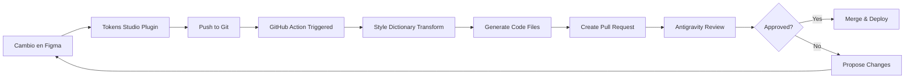
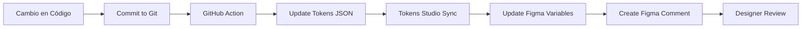
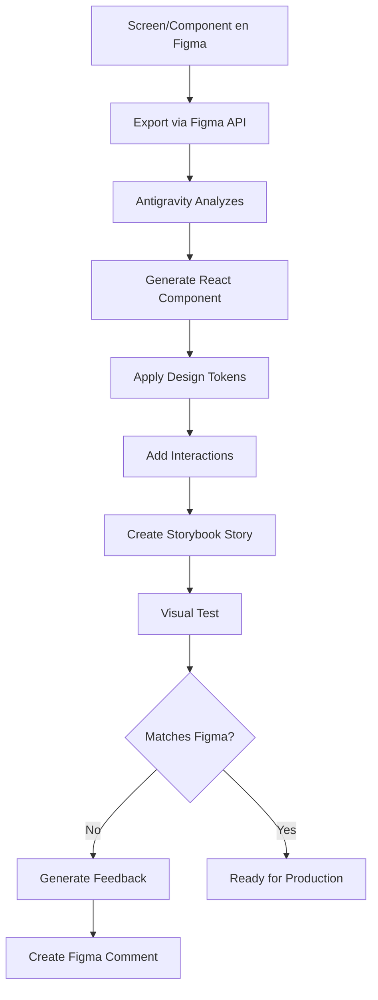

# 🎨 Sistema de Diseño Bidireccional: Figma ↔ Antigravity

## 📋 Índice
1. [Visión General](#visión-general)
2. [Arquitectura del Sistema](#arquitectura-del-sistema)
3. [Estructura de Figma](#estructura-de-figma)
4. [Convenciones de Nomenclatura](#convenciones-de-nomenclatura)
5. [Flujo de Sincronización](#flujo-de-sincronización)
6. [Documentación Viva](#documentación-viva)
7. [Interaction Design & Prototyping](#interaction-design--prototyping)
8. [Roadmap de Implementación](#roadmap-de-implementación)

---

## 🎯 Visión General

### Objetivos del Sistema
- ✅ **Auditoría y Mejora Continua**: Sistema que detecta inconsistencias y propone mejoras automáticamente
- ✅ **Sincronización Bidireccional**: Cambios en Figma → Antigravity y viceversa
- ✅ **Documentación Viva**: Documentación que se actualiza automáticamente con cada cambio
- ✅ **Preview en Tiempo Real**: Visualizar componentes web/mobile antes de implementar
- ✅ **Feedback Loop**: Sistema de propuestas de cambio basado en testing real
- ✅ **Interaction Design**: Prototipos interactivos con efectos y animaciones

### Principios Fundamentales
1. **Single Source of Truth**: Git como fuente única de verdad
2. **Design Tokens First**: Todo se basa en tokens semánticos
3. **Automation Over Manual**: Automatizar todo lo repetible
4. **Living Documentation**: La documentación nunca está desactualizada
5. **AI-Assisted Quality**: IA que audita y propone mejoras constantemente

---

## 🏗️ Arquitectura del Sistema

```
┌─────────────────────────────────────────────────────────────────┐
│                    UX PILOT (AI Plugin) - Opcional              │
│                    Generación rápida de pantallas               │
└───────────────────────────────┬─────────────────────────────────┘
                                │
                                ▼
┌─────────────────────────────────────────────────────────────────┐
│                         FIGMA (Design)                          │
│  ┌──────────┐  ┌──────────┐  ┌──────────┐  ┌──────────┐       │
│  │ Tokens   │  │Components│  │ Layouts  │  │  Screens │       │
│  └────┬─────┘  └────┬─────┘  └────┬─────┘  └────┬─────┘       │
│       │             │             │             │               │
│       └─────────────┴─────────────┴─────────────┘               │
│                     │                                           │
│              Tokens Studio Plugin                               │
└───────────────────────────────┬─────────────────────────────────┘
                                │
                                ▼
┌─────────────────────────────────────────────────────────────────┐
│                GIT REPOSITORY (Code Repository)                 │
│  ┌──────────────────────────────────────────────────────────┐  │
│  │  /tokens/                                                 │  │
│  │    └── tokens.json (sincronizado desde Figma)            │  │
│  │                                                           │  │
│  │  /components/                                             │  │
│  │    ├── react/         (Componentes generados)            │  │
│  │    └── stitches.config.ts (Generado por Antigravity)     │  │
│  │                                                           │  │
│  │  /docs/                                                   │  │
│  │    └── auto-generated/  (Documentación automática)       │  │
│  └──────────────────────────────────────────────────────────┘  │
└───────────────────────────────┬─────────────────────────────────┘
                                │
                                ▼
┌─────────────────────────────────────────────────────────────────┐
│                  ANTIGRAVITY (AI Agent - CORE)                  │
│                                                                 │
│  📥 Lee de:                                                     │
│    • Figma API (diseños y componentes)                         │
│    • Git (tokens.json y código existente)                      │
│                                                                 │
│  ⚙️ Ejecuta internamente:                                       │
│    • Style Dictionary → Transforma tokens                      │
│    • Stitches → Genera CSS-in-JS config                        │
│    • React + TypeScript → Genera componentes                   │
│    • Accessibility Audit → Valida accesibilidad                │
│                                                                 │
│  📤 Genera:                                                     │
│    • Componentes React type-safe                               │
│    • Stitches config con tokens                                │
│    • Stories para Storybook                                    │
│    • Páginas demo completas                                    │
│    • Reportes de accesibilidad                                 │
│    • Documentación automática                                  │
└───────────────────────────────┬─────────────────────────────────┘
                                │
                                ▼
┌─────────────────────────────────────────────────────────────────┐
│                GIT REPOSITORY (Código generado)                 │
└───────────────────────────────┬─────────────────────────────────┘
                                │
                                ▼
┌─────────────────────────────────────────────────────────────────┐
│                  STORYBOOK (Documentación)                      │
│                                                                 │
│  • Lee componentes de Git                                      │
│  • Preview interactivo                                         │
│  • Documentación automática                                    │
│  • Testing visual y de accesibilidad                           │
└───────────────────────────────┬─────────────────────────────────┘
                                │
                                ▼
                 ┌────────────────────────┐
                 │  DEVELOPER HANDOFF     │
                 │  • Componentes React   │
                 │  • Stitches config     │
                 │  • Documentación       │
                 │  • Ejemplos de uso     │
                 └────────────────────────┘
```

### Flujo Simplificado

**1. Diseño:**
- UX Pilot genera pantallas (opcional)
- Designer refina en Figma
- Tokens Studio sincroniza a Git

**2. Generación (Antigravity):**
- Lee diseños de Figma vía API
- Lee tokens de Git
- Ejecuta Style Dictionary internamente
- Genera Stitches config
- Crea componentes React
- Genera documentación base

**3. Documentación:**
- Storybook lee componentes de Git
- Muestra preview interactivo
- Ana refina documentación

**4. Handoff:**
- Developers reciben código production-ready
- Componentes + Tokens + Docs


---

## 📁 Estructura de Figma

### Organización de Archivos

```
📦 Design System (Main File)
│
├── 🎨 01 - Foundations
│   ├── Colors
│   │   ├── Primitives (Base colors)
│   │   ├── Semantic (Contextual colors)
│   │   └── Component (Component-specific)
│   │
│   ├── Typography
│   │   ├── Font Families
│   │   ├── Font Sizes
│   │   ├── Line Heights
│   │   ├── Letter Spacing
│   │   └── Font Weights
│   │
│   ├── Spacing
│   │   ├── Base Scale (4px, 8px, 12px, 16px...)
│   │   └── Semantic (xs, sm, md, lg, xl, 2xl...)
│   │
│   ├── Radius
│   │   └── Values (none, sm, md, lg, full)
│   │
│   ├── Shadows
│   │   └── Elevation Levels (1-5)
│   │
│   ├── Motion
│   │   ├── Duration (fast, normal, slow)
│   │   ├── Easing (ease-in, ease-out, ease-in-out)
│   │   └── Transitions
│   │
│   └── Breakpoints
│       └── Responsive (mobile, tablet, desktop, wide)
│
├── 🎭 02 - Components
│   ├── Atoms
│   │   ├── Button
│   │   ├── Input
│   │   ├── Icon
│   │   ├── Badge
│   │   └── Avatar
│   │
│   ├── Molecules
│   │   ├── SearchBar
│   │   ├── Card
│   │   ├── FormField
│   │   └── NavigationItem
│   │
│   └── Organisms
│       ├── Header
│       ├── Footer
│       ├── Sidebar
│       └── Modal
│
├── 📐 03 - Layouts
│   ├── Grid Systems
│   ├── Page Templates
│   └── Responsive Layouts
│
├── 📱 04 - Screens
│   ├── Web
│   └── Mobile
│
└── 📚 05 - Documentation
    ├── Usage Guidelines
    ├── Do's and Don'ts
    └── Accessibility Notes
```

### Variables en Figma

#### Estructura de Colecciones

```
Collection: Primitives
├── Mode: Default
│   ├── color-primitive-blue-50: #EFF6FF
│   ├── color-primitive-blue-100: #DBEAFE
│   ├── color-primitive-blue-500: #3B82F6
│   ├── color-primitive-blue-900: #1E3A8A
│   └── ...

Collection: Semantic - Light
├── Mode: Light
│   ├── color-bg-primary: {color-primitive-white}
│   ├── color-bg-secondary: {color-primitive-gray-50}
│   ├── color-text-primary: {color-primitive-gray-900}
│   ├── color-brand-primary: {color-primitive-blue-500}
│   └── ...

Collection: Semantic - Dark
├── Mode: Dark
│   ├── color-bg-primary: {color-primitive-gray-900}
│   ├── color-bg-secondary: {color-primitive-gray-800}
│   ├── color-text-primary: {color-primitive-white}
│   ├── color-brand-primary: {color-primitive-blue-400}
│   └── ...

Collection: Components
├── Mode: Default
│   ├── button-bg-primary: {color-brand-primary}
│   ├── button-text-primary: {color-text-on-primary}
│   ├── button-padding-x: {spacing-md}
│   ├── button-padding-y: {spacing-sm}
│   └── ...
```

---

## 🏷️ Convenciones de Nomenclatura

### Design Tokens (Variables)

#### Estructura General
```
{category}-{type}-{variant}-{state}-{scale}
```

#### Categorías y Ejemplos

**1. Colors**
```
Primitives (valores base):
- color-primitive-blue-50
- color-primitive-blue-500
- color-primitive-red-600

Semantic (contextuales):
- color-bg-primary
- color-bg-secondary
- color-bg-tertiary
- color-text-primary
- color-text-secondary
- color-text-disabled
- color-border-default
- color-border-focus
- color-brand-primary
- color-brand-secondary
- color-success-bg
- color-success-text
- color-error-bg
- color-error-text
- color-warning-bg
- color-info-bg

Component-specific:
- button-bg-primary
- button-bg-primary-hover
- button-bg-secondary
- input-border-default
- input-border-focus
- input-border-error
```

**2. Typography**
```
Font Families:
- font-family-sans
- font-family-serif
- font-family-mono

Font Sizes:
- font-size-xs: 12px
- font-size-sm: 14px
- font-size-md: 16px
- font-size-lg: 18px
- font-size-xl: 20px
- font-size-2xl: 24px
- font-size-3xl: 30px
- font-size-4xl: 36px

Line Heights:
- line-height-tight: 1.2
- line-height-normal: 1.5
- line-height-relaxed: 1.75

Font Weights:
- font-weight-light: 300
- font-weight-regular: 400
- font-weight-medium: 500
- font-weight-semibold: 600
- font-weight-bold: 700

Letter Spacing:
- letter-spacing-tight: -0.02em
- letter-spacing-normal: 0
- letter-spacing-wide: 0.02em
```

**3. Spacing**
```
Base Scale (8px base):
- spacing-0: 0px
- spacing-1: 4px
- spacing-2: 8px
- spacing-3: 12px
- spacing-4: 16px
- spacing-5: 20px
- spacing-6: 24px
- spacing-8: 32px
- spacing-10: 40px
- spacing-12: 48px
- spacing-16: 64px
- spacing-20: 80px
- spacing-24: 96px

Semantic:
- spacing-xs: {spacing-1}
- spacing-sm: {spacing-2}
- spacing-md: {spacing-4}
- spacing-lg: {spacing-6}
- spacing-xl: {spacing-8}
- spacing-2xl: {spacing-12}
```

**4. Border Radius**
```
- radius-none: 0px
- radius-sm: 4px
- radius-md: 8px
- radius-lg: 12px
- radius-xl: 16px
- radius-2xl: 24px
- radius-full: 9999px
```

**5. Shadows**
```
- shadow-none: none
- shadow-sm: 0 1px 2px rgba(0,0,0,0.05)
- shadow-md: 0 4px 6px rgba(0,0,0,0.1)
- shadow-lg: 0 10px 15px rgba(0,0,0,0.1)
- shadow-xl: 0 20px 25px rgba(0,0,0,0.15)
```

**6. Motion**
```
Duration:
- duration-instant: 100ms
- duration-fast: 200ms
- duration-normal: 300ms
- duration-slow: 500ms

Easing:
- easing-linear: linear
- easing-ease-in: cubic-bezier(0.4, 0, 1, 1)
- easing-ease-out: cubic-bezier(0, 0, 0.2, 1)
- easing-ease-in-out: cubic-bezier(0.4, 0, 0.2, 1)
```

### Componentes

#### Estructura de Nombres
```
{Category} / {Component} / {Variant} / {State}
```

#### Ejemplos
```
Inputs / Button / Primary / Default
Inputs / Button / Primary / Hover
Inputs / Button / Primary / Active
Inputs / Button / Primary / Disabled
Inputs / Button / Secondary / Default
Inputs / Input / Text / Default
Inputs / Input / Text / Focus
Inputs / Input / Text / Error

Navigation / NavItem / Default
Navigation / NavItem / Active
Navigation / NavItem / Hover

Surfaces / Card / Default
Surfaces / Card / Elevated
Surfaces / Card / Interactive

Feedback / Alert / Success
Feedback / Alert / Error
Feedback / Alert / Warning
Feedback / Alert / Info
```

#### Propiedades de Componentes

**Naming Convention para Props:**
- **Booleans**: `hasIcon`, `isDisabled`, `showLabel`
- **Instance Swaps**: `leadingIcon`, `trailingIcon`, `avatar`
- **Text**: `labelText`, `descriptionText`, `placeholderText`
- **Variants**: `size`, `variant`, `state`

**Ejemplo de Button Component:**
```
Properties:
├── variant: "primary" | "secondary" | "tertiary" | "ghost"
├── size: "sm" | "md" | "lg"
├── state: "default" | "hover" | "active" | "disabled"
├── hasLeadingIcon: boolean
├── hasTrailingIcon: boolean
├── leadingIcon: Icon (instance swap)
├── trailingIcon: Icon (instance swap)
└── labelText: string
```

---

## 🔄 Flujo de Sincronización

### 1. Figma → Git → Antigravity (Design to Code)



**Proceso Detallado:**

1. **Designer hace cambio en Figma**
   - Modifica un token (ej: `button-bg-primary`)
   - Tokens Studio detecta el cambio

2. **Sincronización Automática**
   - Tokens Studio push a Git (branch: `figma-sync/YYYY-MM-DD-HH-MM`)
   - Commit message: `feat(tokens): Update button-bg-primary`

3. **CI/CD Pipeline**
   - GitHub Action se ejecuta automáticamente
   - Style Dictionary transforma tokens a múltiples formatos:
     - `tokens.css` (CSS Custom Properties)
     - `tokens.scss` (SCSS variables)
     - `tokens.js` (JavaScript/TypeScript)
     - `tokens.json` (JSON para documentación)
     - `tailwind.config.js` (Tailwind theme)

4. **Pull Request Automático**
   - Se crea PR con:
     - Diff de cambios
     - Preview de componentes afectados (Storybook)
     - Accessibility audit report
     - Visual regression tests

5. **Antigravity Review**
   - IA analiza el cambio
   - Verifica contraste de colores
   - Detecta breaking changes
   - Propone mejoras si es necesario

6. **Merge & Documentation**
   - Si aprobado: merge automático
   - Documentación se actualiza automáticamente
   - Changelog se genera
   - Notificación a Slack/Discord

### 2. Antigravity → Git → Figma (Code to Design)



**Proceso Detallado:**

1. **Developer/Antigravity hace cambio**
   - Modifica token en código
   - Commit: `feat(tokens): Adjust button padding for better touch targets`

2. **Reverse Sync**
   - GitHub Action detecta cambio en tokens
   - Actualiza `tokens.json` en Git
   - Tokens Studio lee desde Git

3. **Figma Update**
   - Variables en Figma se actualizan automáticamente
   - Se crea un comentario en Figma con:
     - Qué cambió
     - Por qué cambió
     - Link al commit/PR

4. **Designer Notification**
   - Designer recibe notificación
   - Revisa cambios en Figma
   - Puede aprobar o solicitar ajustes

### 3. Componentes: Figma → React



**Proceso Detallado:**

1. **Export de Figma**
   - Usar Figma API para exportar componente
   - Obtener estructura, estilos, y assets

2. **Antigravity Analysis**
   ```
   - Detecta estructura del componente
   - Identifica tokens utilizados
   - Mapea a componentes React existentes
   - Genera código limpio y semántico
   ```

3. **Code Generation**
   ```tsx
   // Auto-generated from Figma
   import { Button } from '@/components/atoms/Button';
   import { Card } from '@/components/molecules/Card';
   
   export const ProductCard = ({ 
     title, 
     description, 
     price, 
     onAddToCart 
   }) => {
     return (
       <Card variant="elevated">
         <Card.Image src={imageUrl} alt={title} />
         <Card.Content>
           <Card.Title>{title}</Card.Title>
           <Card.Description>{description}</Card.Description>
           <Card.Price>{price}</Card.Price>
         </Card.Content>
         <Card.Actions>
           <Button 
             variant="primary" 
             onClick={onAddToCart}
           >
             Add to Cart
           </Button>
         </Card.Actions>
       </Card>
     );
   };
   ```

4. **Visual Regression Test**
   - Captura screenshot del componente React
   - Compara con diseño de Figma
   - Calcula diferencia de píxeles
   - Si > 5% diferencia → genera feedback

5. **Feedback Loop**
   - Si hay discrepancias:
     ```
     📊 Visual Regression Report
     
     Component: ProductCard
     Difference: 8.3%
     
     Issues Found:
     - Button padding: 12px in Figma, 16px in code
     - Card shadow: elevation-2 in Figma, elevation-3 in code
     
     Suggested Fix:
     Option 1: Update Figma (recommended)
       - Change button padding to 16px (better touch target)
     
     Option 2: Update Code
       - Reduce button padding to 12px
     ```

---

## 📖 Documentación Viva

### Sistema de Documentación Automática

```
/docs/
├── auto-generated/
│   ├── tokens/
│   │   ├── colors.md          (Auto-generated from tokens)
│   │   ├── typography.md
│   │   ├── spacing.md
│   │   └── motion.md
│   │
│   ├── components/
│   │   ├── Button.md          (Auto-generated from Storybook)
│   │   ├── Input.md
│   │   └── Card.md
│   │
│   └── changelog/
│       ├── 2026-02-04.md      (Daily changelog)
│       └── weekly-summary.md
│
├── guides/
│   ├── getting-started.md
│   ├── contribution.md
│   └── best-practices.md
│
└── audits/
    └── reports/
        ├── accessibility-2026-02-04.md
        ├── consistency-2026-02-04.md
        └── performance-2026-02-04.md
```

### Template de Documentación de Token

```markdown
# Color: button-bg-primary

## Current Value
`#3B82F6` (Blue 500)

## Usage
Primary background color for main action buttons.

## Related Tokens
- `button-text-primary`: Text color on primary buttons
- `button-bg-primary-hover`: Hover state
- `button-bg-primary-active`: Active state

## Components Using This Token
- Button (Primary variant)
- FloatingActionButton
- CallToAction

## Accessibility
- Contrast ratio with white text: **4.8:1** ✅ (WCAG AA)
- Contrast ratio with black text: **3.2:1** ❌ (Fails WCAG AA)

## History
| Date | Change | Author | Reason |
|------|--------|--------|--------|
| 2026-02-04 | Changed from #2563EB to #3B82F6 | Antigravity | Better contrast ratio |
| 2026-01-15 | Initial value | Designer | Brand color |

## Preview
[Visual preview of the color]
```

### Template de Documentación de Componente

```markdown
# Button Component

## Overview
A versatile button component supporting multiple variants, sizes, and states.

## Figma Link
[View in Figma](https://figma.com/file/...)

## Props
| Prop | Type | Default | Description |
|------|------|---------|-------------|
| variant | 'primary' \| 'secondary' \| 'tertiary' | 'primary' | Button style variant |
| size | 'sm' \| 'md' \| 'lg' | 'md' | Button size |
| disabled | boolean | false | Disabled state |
| hasLeadingIcon | boolean | false | Show leading icon |
| leadingIcon | ReactNode | - | Icon component |
| onClick | () => void | - | Click handler |

## Design Tokens Used
- `button-bg-primary`
- `button-text-primary`
- `button-padding-x`
- `button-padding-y`
- `button-radius`
- `button-shadow`

## Usage Examples

### Basic
\`\`\`tsx
<Button variant="primary">Click me</Button>
\`\`\`

### With Icon
\`\`\`tsx
<Button variant="primary" hasLeadingIcon leadingIcon={<IconPlus />}>
  Add Item
</Button>
\`\`\`

## Accessibility
- ✅ Keyboard navigable
- ✅ Focus visible
- ✅ ARIA labels supported
- ✅ Touch target: 44x44px minimum

## Visual Examples
[Storybook embed]

## Changelog
| Date | Change | Version |
|------|--------|---------|
| 2026-02-04 | Added tertiary variant | 2.1.0 |
| 2026-01-20 | Improved accessibility | 2.0.0 |
```

### Generación Automática

**GitHub Action: `generate-docs.yml`**
```yaml
name: Generate Documentation

on:
  push:
    branches: [main]
    paths:
      - 'tokens/**'
      - 'components/**'

jobs:
  generate:
    runs-on: ubuntu-latest
    steps:
      - uses: actions/checkout@v3
      
      - name: Generate Token Docs
        run: npm run docs:tokens
      
      - name: Generate Component Docs
        run: npm run docs:components
      
      - name: Generate Changelog
        run: npm run docs:changelog
      
      - name: Run Accessibility Audit
        run: npm run audit:a11y
      
      - name: Commit Documentation
        run: |
          git config user.name "Antigravity Bot"
          git add docs/
          git commit -m "docs: Auto-update documentation"
          git push
```

---

## 🎭 Interaction Design & Prototyping

### Estrategia Híbrida

**Figma para:**
- ✅ Prototipos de flujo de usuario (user flows)
- ✅ Transiciones entre pantallas
- ✅ Animaciones simples (hover, click)
- ✅ Presentaciones a stakeholders

**Antigravity/Code para:**
- ✅ Animaciones complejas (physics-based, gestures)
- ✅ Micro-interacciones con datos reales
- ✅ Performance testing
- ✅ Responsive behavior real
- ✅ Accessibility testing con lectores de pantalla

### Sistema de Interaction Tokens

```json
{
  "motion": {
    "duration": {
      "instant": "100ms",
      "fast": "200ms",
      "normal": "300ms",
      "slow": "500ms"
    },
    "easing": {
      "linear": "linear",
      "ease-in": "cubic-bezier(0.4, 0, 1, 1)",
      "ease-out": "cubic-bezier(0, 0, 0.2, 1)",
      "ease-in-out": "cubic-bezier(0.4, 0, 0.2, 1)",
      "spring": "cubic-bezier(0.34, 1.56, 0.64, 1)"
    },
    "transitions": {
      "fade": {
        "duration": "{motion.duration.fast}",
        "easing": "{motion.easing.ease-out}",
        "property": "opacity"
      },
      "slide-up": {
        "duration": "{motion.duration.normal}",
        "easing": "{motion.easing.ease-out}",
        "property": "transform",
        "from": "translateY(20px)",
        "to": "translateY(0)"
      },
      "scale": {
        "duration": "{motion.duration.fast}",
        "easing": "{motion.easing.spring}",
        "property": "transform",
        "from": "scale(0.95)",
        "to": "scale(1)"
      }
    }
  }
}
```

### Workflow de Prototyping

1. **Diseño Inicial en Figma**
   - Crear pantallas y flujos
   - Definir transiciones básicas
   - Exportar specs

2. **Implementación en Código**
   ```tsx
   import { motion } from 'framer-motion';
   import { transitions } from '@/tokens/motion';
   
   export const Modal = ({ isOpen, onClose, children }) => {
     return (
       <AnimatePresence>
         {isOpen && (
           <>
             <motion.div
               className="modal-overlay"
               initial={{ opacity: 0 }}
               animate={{ opacity: 1 }}
               exit={{ opacity: 0 }}
               transition={transitions.fade}
               onClick={onClose}
             />
             <motion.div
               className="modal-content"
               initial={{ opacity: 0, y: 20, scale: 0.95 }}
               animate={{ opacity: 1, y: 0, scale: 1 }}
               exit={{ opacity: 0, y: 20, scale: 0.95 }}
               transition={transitions.slideUp}
             >
               {children}
             </motion.div>
           </>
         )}
       </AnimatePresence>
     );
   };
   ```

3. **Testing & Refinement**
   - Probar en dispositivos reales
   - Medir performance (FPS, timing)
   - Ajustar según feedback

4. **Documentar Interacciones**
   - Grabar videos de interacciones
   - Documentar triggers y behaviors
   - Crear Storybook stories interactivas

### Storybook para Demos Interactivas

```tsx
// Button.stories.tsx
import type { Meta, StoryObj } from '@storybook/react';
import { Button } from './Button';

const meta: Meta<typeof Button> = {
  title: 'Components/Atoms/Button',
  component: Button,
  parameters: {
    design: {
      type: 'figma',
      url: 'https://www.figma.com/file/...',
    },
  },
  argTypes: {
    variant: {
      control: 'select',
      options: ['primary', 'secondary', 'tertiary'],
    },
    size: {
      control: 'select',
      options: ['sm', 'md', 'lg'],
    },
  },
};

export default meta;
type Story = StoryObj<typeof Button>;

export const Primary: Story = {
  args: {
    variant: 'primary',
    children: 'Click me',
  },
};

export const WithInteraction: Story = {
  args: {
    variant: 'primary',
    children: 'Hover me',
  },
  play: async ({ canvasElement }) => {
    // Automated interaction testing
    const button = canvasElement.querySelector('button');
    await userEvent.hover(button);
    await expect(button).toHaveStyle('transform: scale(1.05)');
  },
};
```

---

## 🚀 Roadmap de Implementación

### Fase 1: Fundamentos (Semana 1-2)

**Objetivos:**
- ✅ Configurar estructura de Figma
- ✅ Definir design tokens base
- ✅ Configurar Git repository
- ✅ Instalar Tokens Studio

**Tareas:**
1. **Día 1-2: Auditoría de Archivo Actual**
   - Analizar archivo de Figma existente (si existe)
   - Identificar inconsistencias
   - Documentar mejoras necesarias

2. **Día 3-4: Reestructuración de Figma**
   - Crear nueva estructura de páginas
   - Organizar componentes por categorías
   - Limpiar componentes no utilizados

3. **Día 5-7: Design Tokens**
   - Definir tokens primitivos
   - Crear tokens semánticos
   - Configurar Tokens Studio
   - Conectar con Git

4. **Día 8-10: Configuración de Repositorio**
   - Crear estructura de carpetas
   - Configurar Style Dictionary
   - Setup GitHub Actions
   - Primera sincronización Figma → Git

**Entregables:**
- ✅ Figma file reestructurado
- ✅ Tokens JSON en Git
- ✅ Documentación de convenciones
- ✅ CI/CD pipeline básico

### Fase 2: Sincronización Bidireccional (Semana 3-4)

**Objetivos:**
- ✅ Implementar Figma → Code
- ✅ Implementar Code → Figma
- ✅ Automatizar transformaciones
- ✅ Setup Storybook

**Tareas:**
1. **Semana 3: Figma to Code**
   - Configurar GitHub Actions para transformación
   - Generar CSS, SCSS, JS, JSON
   - Crear componentes React base
   - Setup Storybook

2. **Semana 4: Code to Figma**
   - Configurar reverse sync
   - Implementar Figma API updates
   - Crear sistema de notificaciones
   - Testing de sincronización

**Entregables:**
- ✅ Pipeline bidireccional funcionando
- ✅ Storybook con componentes base
- ✅ Documentación de flujo de trabajo

### Fase 3: Auditoría & IA (Semana 5-6)

**Objetivos:**
- ✅ Implementar auditorías automáticas
- ✅ Integrar Antigravity para análisis
- ✅ Sistema de feedback
- ✅ Visual regression testing

**Tareas:**
1. **Semana 5: Auditorías**
   - Accessibility audits (contraste, ARIA)
   - Consistency checks
   - Performance audits
   - Generar reportes automáticos

2. **Semana 6: IA Integration**
   - Antigravity analiza cambios
   - Propone mejoras automáticamente
   - Visual regression con Percy/Chromatic
   - Feedback loop a Figma

**Entregables:**
- ✅ Sistema de auditoría automática
- ✅ Reportes de IA
- ✅ Visual regression tests

### Fase 4: Documentación Viva (Semana 7-8)

**Objetivos:**
- ✅ Documentación auto-generada
- ✅ Changelog automático
- ✅ Site de documentación
- ✅ Búsqueda y navegación

**Tareas:**
1. **Semana 7: Generación**
   - Scripts para generar docs de tokens
   - Scripts para generar docs de componentes
   - Changelog automation
   - Integración con Storybook

2. **Semana 8: Documentation Site**
   - Setup Docusaurus/Nextra
   - Deploy documentation site
   - Búsqueda y filtros
   - Versioning

**Entregables:**
- ✅ Documentation site live
- ✅ Auto-generated docs
- ✅ Changelog system

### Fase 5: Interaction Design (Semana 9-10)

**Objetivos:**
- ✅ Motion tokens
- ✅ Animaciones en componentes
- ✅ Prototipos interactivos
- ✅ Performance testing

**Tareas:**
1. **Semana 9: Motion System**
   - Definir motion tokens
   - Implementar con Framer Motion
   - Documentar interacciones
   - Crear demos

2. **Semana 10: Advanced Prototyping**
   - Prototipos complejos en código
   - Gesture handling
   - Physics-based animations
   - Mobile testing

**Entregables:**
- ✅ Motion system completo
- ✅ Prototipos interactivos
- ✅ Performance benchmarks

### Fase 6: Optimización & Escalado (Semana 11-12)

**Objetivos:**
- ✅ Optimizar workflows
- ✅ Multi-brand support
- ✅ Theming avanzado
- ✅ Training & handoff

**Tareas:**
1. **Semana 11: Optimización**
   - Mejorar velocidad de sync
   - Reducir false positives en audits
   - Optimizar generación de docs
   - Caching strategies

2. **Semana 12: Escalado**
   - Multi-brand/multi-theme setup
   - Team training
   - Documentation de workflows
   - Handoff procedures

**Entregables:**
- ✅ Sistema optimizado
- ✅ Multi-brand support
- ✅ Team training materials

---

## 🛠️ Stack Tecnológico

### Herramientas Principales

**Design:**
- Figma (Design tool)
- Tokens Studio (Token management)
- FigJam (Collaboration)

**Development:**
- React + TypeScript
- Tailwind CSS (opcional)
- Framer Motion (Animations)
- Storybook (Component library)
- Vitest (Testing)

**Automation:**
- GitHub Actions (CI/CD)
- Style Dictionary (Token transformation)
- Figma API (Sync)
- n8n (Advanced workflows - opcional)

**Documentation:**
- Docusaurus / Nextra
- Storybook Docs
- MDX

**Testing:**
- Percy / Chromatic (Visual regression)
- Axe (Accessibility)
- Lighthouse (Performance)

**Monitoring:**
- Sentry (Error tracking)
- Analytics (Usage tracking)

---

## 📊 Métricas de Éxito

### KPIs del Sistema

1. **Sync Reliability**
   - Target: 99.9% success rate
   - Measure: Failed syncs / Total syncs

2. **Time to Sync**
   - Target: < 2 minutes from Figma change to PR
   - Measure: Timestamp diff

3. **Documentation Coverage**
   - Target: 100% of tokens documented
   - Target: 100% of components documented

4. **Accessibility Score**
   - Target: 100% WCAG AA compliance
   - Measure: Axe audit results

5. **Visual Regression**
   - Target: < 2% false positives
   - Measure: Manual review needed / Total tests

6. **Developer Satisfaction**
   - Target: 4.5/5 stars
   - Measure: Quarterly survey

7. **Design-Dev Handoff Time**
   - Target: 50% reduction
   - Measure: Time from design complete to dev complete

---

## 🎓 Próximos Pasos

### Acción Inmediata

1. **Compartir tu archivo de Figma**
   - Necesito acceso para hacer la auditoría inicial
   - Identificar qué existe y qué necesita mejorarse

2. **Crear Figma Access Token**
   - Settings → Account → Personal Access Tokens
   - Scope: File content, Variables, Comments

3. **Decidir estructura de Git**
   - ¿Repositorio nuevo o existente?
   - ¿Monorepo o múltiples repos?

4. **Definir prioridades**
   - ¿Qué fase es más urgente?
   - ¿Qué componentes son críticos?

### Preguntas para Ti

1. ¿Tienes ya un archivo de Figma que quieres auditar?
2. ¿Qué framework usas actualmente? (React, Vue, Angular, etc.)
3. ¿Tienes ya componentes en código o empezamos desde cero?
4. ¿Necesitas soporte multi-brand/multi-theme?
5. ¿Qué nivel de automatización quieres? (básico, intermedio, avanzado)

---

## 📚 Recursos Adicionales

### Lecturas Recomendadas
- [Design Tokens Community Group](https://design-tokens.github.io/community-group/)
- [Style Dictionary Documentation](https://amzn.github.io/style-dictionary/)
- [Tokens Studio Documentation](https://docs.tokens.studio/)
- [Figma API Reference](https://www.figma.com/developers/api)

### Templates & Starters
- [Design System Starter Kit](https://github.com/...)
- [Tokens Studio Examples](https://github.com/...)
- [Style Dictionary Examples](https://github.com/...)

---

**Última actualización:** 2026-02-04  
**Versión:** 1.0.0  
**Autor:** Antigravity AI
